# A Temporal Benchmark<br/>
<!-- .element style="font-size:85px" -->
# in Benchbase
<!-- .element style="font-size:85px" -->

Paul A. Jungwirth

PGConf.dev 2025

14 May 2025

Notes:

- Hi, I'm Paul Jungwirth, a freelance programmer from Portland, Oregon.
- I've been working on adding support for SQL:2011 temporal features to Postgres, in particular application time.
    - Temporal primary and foreign keys are in v18 (so far!),
      and I have patches for temporal `UPDATE` & `DELETE` and SQL:2011 `PERIOD`s.
    - If all that gets in, Postgres will be the first RDBMS to support all of SQL:2011 application time.
- But no one to my knowledge has ever published a benchmark for temporal databases.
    - I wrote one using the Benchbase framework,
      so I want to show the procedures it includes
      and how I used it to compare three different implementations of temporal foreign keys.
- You know they closed the Call for Papers before they announced the keynote speaker---that's not really fair.
  - Many people here are more qualified to design a benchmark, so if you have any feedback at the end or later in the hallway, I'm happy to hear how this could be better.


# Temporal Tables

```sql[|5|8-9|]
CREATE EXTENSION btree_gist;

CREATE TABLE employees (
  id       int GENERATED BY DEFAULT AS IDENTITY,
  valid_at daterange,
  name     text NOT NULL,
  salary   int NOT NULL,
  CONSTRAINT employees_pkey
    PRIMARY KEY (id, valid_at WITHOUT OVERLAPS)
);
```

Notes:

- Why does temporal need its own benchmark anyway?
- It's because every table has two extra columns, giving the start & end time for when the row is true.
    - Or in Postgres it's one extra column, and it's a range or multirange. (here)
- This means you need a different schema from any other benchmark.
- Then the temporal primary keys and foreign keys include those range columns, (here)
- and there is special syntax for temporal updates and deletes.
- Also you want temporal semantics for inner join, outer join, semijoin, antijoin, aggregates, union, intersect, and except.


# Past Work

```
EMPLOYEES(SSN, LAST_NAME, FIRST_NAME, ANNUAL_SALARY)

POSITIONS(PCN, JOB_TITLE_CODE1)

INCUMBENTS(SSN, PCN, START_DATE, END_DATE)

JOB_TITLES(JOB_TITLE_CODE, JOB_TITLE)
```

<pre>
Richard Snodgrass,
University of Arizona employee database
</pre>

Notes:

- So are there any temporal schemas out there we could borrow? Ideally with a dataset?
- Richard Snodgrass, who is like the godfather of temporal data, describes a temporal database used at the University of Arizona, where he taught:
  - It is the venerable employee database!
  - This is used over and over for examples in his book.
  - As far as I can tell he never shows DDL to create the tables, even on the CD ROM, but Chapter 5 gives enough details to suffice for his examples.
  - Here I'm showing the tables and their salient columns.
  - You can see we've got some old-school column names.
    - `SSN` is the primary key of `EMPLOYEES` (no PII concerns there!),
    - `PCN` is the primary key of `POSITIONS`.
  - Initially `incumbents` is the only temporal table.
    - You can see its start and end columns.
- There is another example in Chapter 11 that is more interesting, for a feed yard, but this is enough for now.


# Past Work

<div class="r-stack">
  <p class="fragment preload">
    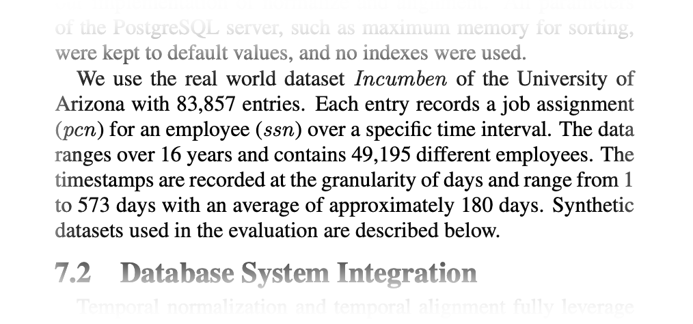
  </p>
  <p class="fragment">
    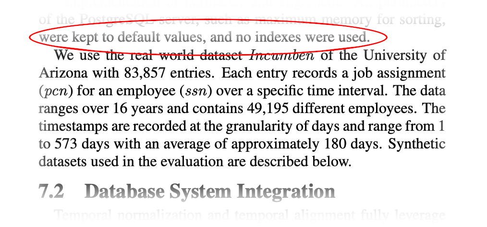
  </p>
</div>

Notes:

- There are benchmark *results* reported in my favorite temporal paper, by Dignös, Böhlen, and Gamper in 2012.
  - You might remember this paper.
  - The authors submitted a patch in 2016 implementing this paper.
  - The paper includes a performance comparison of plain SQL vs their new exec node.
- They say they are using the *Incumben* dataset:
  - a temporal database about employees,
  - from the University of Arizona,
  - with columns like `pcn` and `ssn`.
- I've never been able to find this published anywhere.
  - I asked the authors, but they didn't answer.
- They also don't publish their SQL for a temporal outer join, whose performance they compare to their patched Postgres.

- Also their benchmarks used a default `work_mem` and no indexes.
- I would love to run them myself, but they aren't available.


# Benchbase<br/>née OLTP-Bench

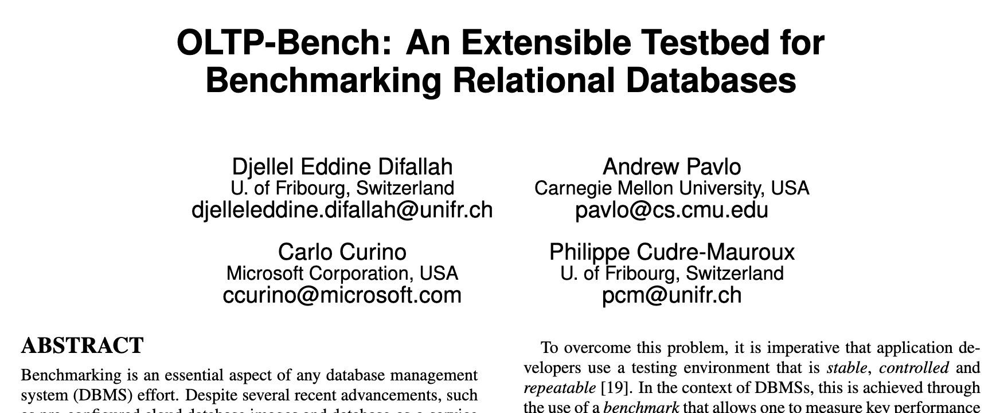

Notes:

- So I wrote my own benchmark.
- I used a tool called Benchbase.
- This is a Java-based framework from Carnegie-Mellon, published in 2013.
  - It was originally published as OLTP-Bench.
  - At some point it was renamed to Benchbase.
  - You can find both repos on github.
- It contains about 20 benchmarks that you can run on about 20 database vendors.
  - TPC-C is in there, and also TPC-H.
  - There are some real-world datasets, like Twitter and Wikipedia.
  - There are microbenchmarks like SIBench and YCSB.
- Each benchmark defines a schema, a way to load initial data, and a bunch of "procedures" that make up the benchmark workload.
- When you run a benchmark, you can tweak a bunch of options, including which procedures to run in what proportion, so there is really a lot of potential for experimenting.
- I talked about all this last summer in Portland,
  but today I have half the time and more results to cover,
  so I'm not going to say much about Benchbase.
  If you want more details, the slides to my earlier talk are linked at the end.


# DDL

```
CREATE TABLE employees (
    id          int GENERATED BY DEFAULT AS IDENTITY NOT NULL,
    valid_at    daterange NOT NULL,
    name        text NOT NULL,
    salary      int NOT NULL,
    PRIMARY KEY (id, valid_at WITHOUT OVERLAPS)
);

CREATE TABLE positions (
    id          int GENERATED BY DEFAULT AS IDENTITY NOT NULL,
    valid_at    daterange NOT NULL,
    name        text NOT NULL,
    employee_id int NOT NULL,
    PRIMARY KEY (id, valid_at WITHOUT OVERLAPS),
    FOREIGN KEY (employee_id, PERIOD valid_at) REFERENCES employees (id, PERIOD valid_at)
);
CREATE INDEX idx_positions_employee_id ON positions USING gist (employee_id, valid_at);
```

Notes:

- My benchmark has just two tables: `employees` and `positions`.
- This is enough for what we want:
  - To benchmark the GiST primary key, we'll do inserts.
  - We can benchmark temporal updates and deletes.
  - It lets us benchmark joins and other binary relational operations.
  - And the big one, benchmarking temporal foreign keys.
- Some of this is in v18, but for updates & deletes you'll need to apply my outstanding patches.


# `InsertPosition`

```java[|4-10|12-22]
package com.oltpbenchmark.benchmarks.temporal.procedures;

public class InsertPosition extends Procedure {
  public final SQLStmt insertPosition =
      new SQLStmt(
          "INSERT INTO positions "
          + "(employee_id, valid_at, name) "
          + "VALUES "
          + "(?, daterange(?, ?), concat(?, ' ', to_char(?, 'RN'))) "
          + "RETURNING id");

  public int run(Connection conn, int employeeId, String duty, LocalDate s, LocalDate e, int rank)
      throws SQLException {
    try (PreparedStatement stmt = this.getPreparedStatement(conn, insertPosition)) {
      stmt.setInt(1, employeeId);
      stmt.setDate(2, s == null ? null : Date.valueOf(s));
      stmt.setDate(3, e == null ? null : Date.valueOf(e));
      stmt.setString(4, duty);
      stmt.setInt(5, rank);
      stmt.execute();
      return -1;
    }
  }
}
```

Notes:

- Here is a simple example of a procedure.
  It adds a new position, assigned to a given employee.
- Here is the SQL statement (here)
- And then some standard JDBC to run it (here)


# Procedures

```console
DeleteEmployee.java
InsertPosition.java
Noop.java
SelectAllEmployees.java
SelectAllEmployeesWithOptionalPositions.java
SelectEmployeesWithoutPosition.java
SelectEmployeesWithPosition.java
SelectOneEmployee.java
SelectOneEmployeePositions.java
SelectOneEmployeeWithOptionalPositions.java
UpdateEmployee.java
UpdatePosition.java
```

Notes:

- Here are the procedures I've defined.
- There are some normal operations, like insert, update, delete, select one, select all.
- There are procedures for inner join, left outer join, semijoin, and antijoin.
  - That's the most interesting part, because believe it or not no one has ever published SQL to do some of those things with temporal data.
  - Those are based on a github repo I have that documents how to do them and validates them with a few tests.


# `TemporalWorker`

```java
private RandomEmployee makeRandomEmployee(boolean gaussianEmployee, double maxYears) {
  int id = model.gaussianEmployeeId(rng());
  LocalDate s;
  LocalDate e;

  if (TemporalConstants.CHECK_FK_GAUSSIAN_RANGE) {
    s = model.today.plusDays(model.gaussianDays(rng(), (int) Math.round(maxYears * 365)));
  } else {
    s = model.today.plusDays(-rng().nextInt(365 * TemporalConstants.MAX_EMPLOYEE_TENURE));
  }
  // Pick a range from 1 day to 2 years:
  e = s.plusDays(1 + rng().nextInt(365 * 2));

  return new RandomEmployee(id, s, e)
}
```

Notes:

- So as Benchbase chooses these procedures, it feeds them to a worker class, which can do things like pick inputs.
- The framework has some nice helpers, like getting gaussian or zipfian random numbers, so that your data is more realistic.
- For instance some employees will hold more positions, and thus get more updates, so their ID will have more records.


# Foreign Keys

- `EXISTS`
- `lag`
- `range_agg`

Notes:

- The main thing I've done so far is measure my foreign keys patch.
  - Peter Eisentraut asked for this on the mailing list,
    questions like, "Have you confirmed that it uses the index?"
- Using an index is easy to check, but I wanted some defensible numbers,
  and I wanted to start building a temporal benchmark anyway.
- But numbers are hard to interpret if you can't compare them to anything.
  - So I thought it would be interesting to compare three different ways of implementing temporal foreign keys.
- Snodgrass gives a query in his book.
    - It's about a page of SQL.
    - I'll show it in a second.
    - I call it the `EXISTS` implementation.
- There is SQL from Vik Fearing's excellent `periods` extension.
  - I think the main insight is using windows functions, so I'll call it the `lag` implementation.
- And there is the SQL I used in my patch, which uses Postgres ranges and multiranges, especially a function called `range_agg`.
- So to compare them, I wanted 3 Postgres clusters, each with a different implementation.
- I took my foreign keys patch and added `ifdef`s, so that I had a compile-time option to use whichever implementation I wanted.
  - I never submitted that version to the mailing list, but it's in my personal Postgres github repo.
  - Now I could compile and run a separate cluster for each implementation,
    and run benchmarks by doing updates, deletes, and inserts that fire the foreign keys.


# `EXISTS` impl

```sql
SELECT 1
-- There was a PK when the FK started:
WHERE EXISTS
  SELECT  1
  FROM    [ONLY] <pktable>
  WHERE   pkatt1 = $1 [AND ...]
  AND     COALESCE(lower(pkperiodatt), '-Infinity')
       <= COALESCE(lower($n), '-Infinity')
  AND     COALESCE(lower($n), '-Infinity')
       <  COALESCE(upper(pkperiodatt), 'Infinity')
  FOR KEY SHARE OF x
)
...
```

Notes:

- Here is part 1 of the OG foreign keys implementation.
- In Snodgrass this is a `CHECK` constraint,
  which you can't do in Postgres, so I had to rewrite it.
  - Like any foreign key, it's a constraint trigger, which inverts the logic.
      - In the book he's asking "Is every record valid?"
      - As a constraint trigger you ask "Is any record invalid?"
      - That probably makes things faster.
        - Originally we have 3 big parts joined by ORs.
        - Now we have 3 big parts joined by ANDs.
        - Postgres in my experience does a lot better with ANDs than with ORs.
        - Also the whole thing was wrapped in a `NOT EXISTS` before, and that disappears.
- Also I'm adapting the range column to use start/end dates, because otherwise it's just too much editing on my part.
  - In particular this requires interpreting how ranges use `NULL` to represent an unbounded start or end.
  - We require the range column because it gives us a temporal primary key.
  - In one of my not-yet-committed patches I add support for SQL:2011 `PERIOD`s so you can have separate start and end columns if you prefer,
    - but there is still a hidden generated range column behind the scenes.
- So Part 1 here asks if the *start* of the record is covered.
  - That's what you see here.


# `EXISTS` impl

```sql
-- There was a PK when the FK ended:
AND EXISTS (
  SELECT  1
  FROM    [ONLY] <pktable>
  WHERE   pkatt1 = $1 [AND ...]
  AND     COALESCE(lower(pkperiodatt), '-Infinity')
       <  COALESCE(upper($n), 'Infinity')
  AND     COALESCE(upper($n), 'Infinity')
       <= COALESCE(upper(pkperiodatt), 'Infinity')
  FOR KEY SHARE OF x
)
...
```

Notes:

- Here is part 2.
- This asks if the *end* of the record is covered.
- Notice all these less thans and less-than-or-equals.
- I checked those about 10 times.
- Implementing this as a compile-time option in my patch let me run my regress tests on it,
  which was really reassuring.


# `EXISTS` impl

```sql
-- There are no gaps in the PK:
-- (i.e. there is no PK that ends early,
-- unless a matching PK record starts right away)
AND NOT EXISTS (
  SELECT  1
  FROM    [ONLY] <pktable> AS pk1
  WHERE   pkatt1 = $1 [AND ...]
  AND     COALESCE(lower($n), '-Infinity')
       <  COALESCE(upper(pkperiodatt), 'Infinity')
  AND     COALESCE(upper(pkperiodatt), 'Infinity')
       <  COALESCE(upper($n), 'Infinity')
  ...
```

Notes:

- Here is part 3.1.
- We found a record to cover the start of our reference and to cover the end,
  so now we make sure the referenced table has no gaps in between.
- In other words there is no record that ends early ...


# `EXISTS` impl

```sql
  ...
  AND     NOT EXISTS (
    SELECT  1
    FROM    [ONLY] <pktable> AS pk2
    WHERE   pk1.pkatt1 = pk2.pkatt1 [AND ...]
            -- but skip pk1.pkperiodatt && pk2.pkperiodatt
    AND     COALESCE(lower(pk2.pkperiodatt), '-Infinity')
         <= COALESCE(upper(pk1.pkperiodatt), 'Infinity')
            COALESCE(upper(pk1.pkperiodatt), 'Infinity')
         <  COALESCE(upper(pk2.pkperiodatt), 'Infinity')
    FOR KEY SHARE OF pk2
  )
  FOR KEY SHARE OF pk1
)
```

Notes:

- ... unless there is another record that picks up immediately where it left off.


# `EXISTS` impl

```console[|23|3,8,13]
 Result  (cost=33.28..33.29 rows=1 width=4)
   One-Time Filter: ((InitPlan 1).col1 AND (InitPlan 2).col1 AND (NOT (InitPlan 4).col1))
   InitPlan 1
     ->  LockRows  (cost=0.28..8.32 rows=1 width=10)
           ->  Index Scan using employees_pkey on employees x  (cost=0.28..8.31 rows=1 width=10)
                 Index Cond: ((id = 24374) AND (valid_at && '[2025-05-11,2026-05-26)'::daterange))
                 Filter: ((COALESCE(lower(valid_at), '-infinity'::date) <= '2025-05-11'::date) AND ('2025-05-11'::date < COALESCE(upper(valid_at), 'infinity'::date)))
   InitPlan 2
     ->  LockRows  (cost=0.28..8.32 rows=1 width=10)
           ->  Index Scan using employees_pkey on employees x_1  (cost=0.28..8.31 rows=1 width=10)
                 Index Cond: ((id = 24374) AND (valid_at && '[2025-05-11,2026-05-26)'::daterange))
                 Filter: ((COALESCE(lower(valid_at), '-infinity'::date) < '2026-05-26'::date) AND ('2026-05-26'::date <= COALESCE(upper(valid_at), 'infinity'::date)))
   InitPlan 4
     ->  LockRows  (cost=0.28..16.64 rows=1 width=10)
           ->  Index Scan using employees_pkey on employees pk1  (cost=0.28..16.63 rows=1 width=10)
                 Index Cond: ((id = 24374) AND (valid_at && '[2025-05-11,2026-05-26)'::daterange))
                 Filter: (('2025-05-11'::date < COALESCE(upper(valid_at), 'infinity'::date)) AND (COALESCE(upper(valid_at), 'infinity'::date) < '2026-05-26'::date) AND (NOT EXISTS(SubPlan 3)))
                 SubPlan 3
                   ->  LockRows  (cost=0.28..8.32 rows=1 width=10)
                         ->  Index Scan using employees_pkey on employees pk2  (cost=0.28..8.31 rows=1 width=10)
                               Index Cond: (id = pk1.id)
                               Filter: ((COALESCE(lower(valid_at), '-infinity'::date) <= COALESCE(upper(pk1.valid_at), 'infinity'::date)) AND (COALESCE(upper(pk1.valid_at), 'infinity'::date) < COALESCE(upper(valid_at), 'infinity'::date)))
(22 rows)
```

Notes:

- Here is the plan for exists. Pretty complicated!
- It's 22 rows. (here)
- You can see the tripartite structure.

- Technically we need three queries, because FKs need checks under these conditions:
  - If a PK is deleted/updated, check for FKs that are now invalid.
  - If an FK is inserted/updated, check for PKs that make it valid.
  - Run a big check when you create the FK, to reject any invalid rows that are there already.
  - I'm showing today is the check you'd run for a new FK row.
    - In practice all the queries are extremely similar.


# `LAG` impl

```sql[|11|17|17-18|5,17-19]
SELECT  1
FROM    (
  SELECT  uk.uk_start_value,
          uk.uk_end_value,
          NULLIF(LAG(uk.uk_end_value) OVER (ORDER BY uk.uk_start_value), uk.uk_start_value) AS x
  FROM   (
    SELECT  coalesce(lower(x.pkperiodatt), '-Infinity') AS uk_start_value,
            coalesce(upper(x.pkperiodatt), 'Infinity') AS uk_end_value
    FROM    pktable AS x
    WHERE   pkatt1 = $1 [AND ...]
    AND     uk.pkperiodatt && $n
    FOR KEY SHARE OF x
  ) AS uk
) AS uk
WHERE   uk.uk_start_value < upper($n)
AND     uk.uk_end_value >= lower($n)
HAVING  MIN(uk.uk_start_value) <= lower($n)
AND     MAX(uk.uk_end_value) >= upper($n)
AND     array_agg(uk.x) FILTER (WHERE uk.x IS NOT NULL) IS NULL
```
<!-- .element style="margin-top:0; margin-bottom:0; font-size:40%" -->

Notes:

- Here is SQL for Vik's implementation.
- As you can see, this is *much* simpler!
- It's not exactly what he has in his extension, but I tried to be faithful to the original.
  - Again I had to adapt ranges to separate start/end columns and use a sentinel value instead of null.
  - I did add a range overlaps operator [show],
    both here and in `EXISTS`,
    so that all implementations could use the full GiST index to find rows that are relevant.
    Otherwise it didn't seem like a fair comparison.
- Conceptually, this is a lot like Snodgrass's idea.
- It checks that the beginning of the reference is covered. (here)
- It checks that the end is covered. (here)
- And it checks that there are no gaps. (here)
- But instead of those nested `NOT EXISTS`, we can use a window function.


# `LAG` impl

```console
 Aggregate  (cost=8.38..8.40 rows=1 width=4)
   Filter: ((array_agg(uk.x) FILTER (WHERE (uk.x IS NOT NULL)) IS NULL) AND (min(uk.uk_start_value) <= '2025-05-11'::date) AND (max(uk.uk_end_value) >= '2026-05-26'::date))
   ->  Subquery Scan on uk  (cost=8.33..8.37 rows=1 width=12)
         Filter: ((uk.uk_start_value < '2026-05-26'::date) AND (uk.uk_end_value >= '2025-05-11'::date))
         ->  WindowAgg  (cost=8.33..8.36 rows=1 width=12)
               Window: w1 AS (ORDER BY uk_1.uk_start_value)
               ->  Sort  (cost=8.33..8.34 rows=1 width=8)
                     Sort Key: uk_1.uk_start_value
                     ->  Subquery Scan on uk_1  (cost=0.28..8.32 rows=1 width=8)
                           ->  LockRows  (cost=0.28..8.31 rows=1 width=14)
                                 ->  Index Scan using employees_pkey on employees x  (cost=0.28..8.30 rows=1 width=14)
                                       Index Cond: ((id = 24374) AND (valid_at && '[2025-05-11,2026-05-26)'::daterange))
(12 rows)
```
Notes:

- Here is the plan for lag.
- It's only 12 lines: saving nearly half.
- We're using the index.
- We do a sort to feed into our window function.
- Then there is another aggregate at the top, to look for gaps.


# `range_agg` impl

```sql[|5-6|9|]
SELECT 1
FROM    (
  SELECT pkperiodatt AS r
  FROM   [ONLY] pktable x
  WHERE  pkatt1 = $1 [AND ...]
  AND    pkperiodatt && $n
  FOR KEY SHARE OF x
) x1
HAVING $n <@ range_agg(x1.r)
```

Notes:

- And here is the `range_agg` implementation.
- I like that it's the simplest.
- Hopefully that means it does the least work.
- We find all the relevant records in the referenced table, (here)
- ... then we combine them and make sure they include the referencing range. (here)
- You could almost write this without a subquery, but `FOR KEY SHARE` doesn't support aggregate queries.
  - It's on my list of future improvements!
- Performance aside, note this is the only implementation that supports multiranges and potentially any user-defined type for which you can supply an aggregate function and operators for overlaps and contained-by.
  - This leaves the door open to support spatial types, box, or whatever you imagine.
  - Also it lets you have ranges over any type, not just date and timestamp.
    - Those other types might not have nice sentinel values like plus/minus infinity.


# `range_agg` impl

```console
 Aggregate  (cost=8.32..8.34 rows=1 width=4)
   Filter: ('[2025-05-11,2026-05-26)'::daterange <@ range_agg(x1.r))
   ->  Subquery Scan on x1  (cost=0.28..8.32 rows=1 width=10)
         ->  LockRows  (cost=0.28..8.31 rows=1 width=16)
               ->  Index Scan using employees_pkey on employees x  (cost=0.28..8.30 rows=1 width=16)
                     Index Cond: ((id = 24374) AND (valid_at && '[2025-05-11,2026-05-26)'::daterange))
(6 rows)
```

Notes:

- Here is the plan for it.
- Only 6 rows.
- We're using the index.
- There is no sort, and just one aggregation.
- Truthfully the sort is happening inside `range_agg`.
- But still I think we're saving some time compared to separate calls to `lag`, `array_agg`, `nullif`, `min`, and `max`.
  - Does it seem like there is a high overhead for function calls?
    - Like even calling `FIRST` (or `any_value`) inside an aggregate seems expensive.


# Hypothesis

- `range_agg` fastest
- `lag` nearly as fast
- `EXISTS` much slower

Notes:

- My hypothesis is that `range_agg` will be fastest, `lag` also very good,
  and `EXISTS` really slow.


# Workload

```xml
<transactiontypes>
    <transactiontype>
        <name>InsertPosition</name>
    </transactiontype>
    <transactiontype>
        <name>UpdatePosition</name>
    </transactiontype>
    <transactiontype>
        <name>UpdateEmployee</name>
    </transactiontype>
    <transactiontype>
        <name>DeleteEmployee</name>
    </transactiontype>
</transactiontypes>
```

Notes:

- So it's time to run some benchmarks.
- There are four ways to trigger an FK check, so let's fire them all.
- The first thing I noticed is there is not that much difference.
- In all the noise of doing an insert or update or whatever, it was hard to find a signal.
- Also it was annoying running separate benchmarks against three different clusters.


# Procedures

```console
CheckForeignKeyExists.java
CheckForeignKeyLag.java
CheckForeignKeyRangeAgg.java
```

Notes:

- So I added more Benchbase procedures that just run the foreign key SQL directly.
- Now we're moving away from a real-life workflow to a targeted microbenchmark.
- But it should highlight the perf difference.
- Actually it was still hard to distinguish differences, although I could see running the queries casually in psql there *was* a difference.
- It turns out benchbase does a commit after every transaction, and even though there was nothing to write that was still causing a delay at least 10 times the cost of the query.
    - So I got crazy and switched to no fsync.
- Another nice thing is now I can run these three procedures simultaneously, as one benchmark, without a patched Postgres.
  - I just give each procedure 33% of the workload.
  - The last 1% I gave to my Noop procedure.
- It also means that any non-benchmark activity on the machine should affect all implementations equally, because they are all running simultaneously.


# 95% Latency


Notes:

- At the 95th percentile, my guess is basically confirmed.
- Here is latency.
- You can see the blue `range_agg` line is consistently at the bottom,
  and the green `exists` line is almost always at the top.


# Mean Latency

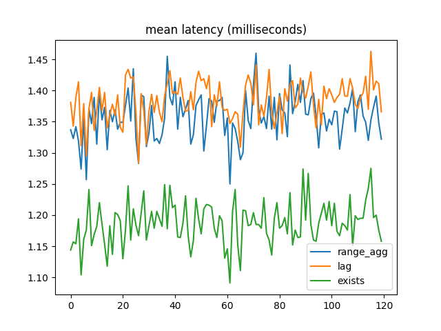

Notes:

- Wait but in mean latency `EXISTS` is way faster!
- What is going on here?
- I thought it must be erroring out or something.
- Upon closer look at the Benchbase results, I saw that over half of the transactions were failing because of invalid foreign keys.
- So maybe that was a clue.


# `EXISTS` impl

```console[|9-10,15-16,21-22]
 Result (actual time=0.020..0.020 rows=0.00 loops=1)
   One-Time Filter: ((InitPlan 1).col1 AND (InitPlan 2).col1 AND (NOT (InitPlan 4).col1))
   InitPlan 1
     ->  LockRows (actual time=0.018..0.018 rows=0.00 loops=1)
           ->  Index Scan using employees_pkey on employees x (actual time=0.017..0.017 rows=0.00 loops=1)
                 Index Cond: ((id = 24374000) AND (valid_at && '[2025-05-11,2026-05-26)'::daterange))
                 Filter: ((COALESCE(lower(valid_at), '-infinity'::date) <= '2025-05-11'::date) AND ('2025-05-11'::date < COALESCE(upper(valid_at), 'infinity'::date)))
                 Index Searches: 1
   InitPlan 2
     ->  LockRows (never executed)
           ->  Index Scan using employees_pkey on employees x_1 (never executed)
                 Index Cond: ((id = 24374000) AND (valid_at && '[2025-05-11,2026-05-26)'::daterange))
                 Filter: ((COALESCE(lower(valid_at), '-infinity'::date) < '2026-05-26'::date) AND ('2026-05-26'::date <= COALESCE(upper(valid_at), 'infinity'::date)))
                 Index Searches: 0
   InitPlan 4
     ->  LockRows (never executed)
           ->  Index Scan using employees_pkey on employees pk1 (never executed)
                 Index Cond: ((id = 24374000) AND (valid_at && '[2025-05-11,2026-05-26)'::daterange))
                 Filter: (('2025-05-11'::date < COALESCE(upper(valid_at), 'infinity'::date)) AND (COALESCE(upper(valid_at), 'infinity'::date) < '2026-05-26'::date) AND (NOT EXISTS(SubPlan 3)))
                 Index Searches: 0
                 SubPlan 3
                   ->  LockRows (never executed)
                         ->  Index Scan using employees_pkey on employees pk2 (never executed)
                               Index Cond: (id = pk1.id)
                               Filter: ((COALESCE(lower(valid_at), '-infinity'::date) <= COALESCE(upper(pk1.valid_at), 'infinity'::date)) AND (COALESCE(upper(pk1.valid_at), 'infinity'::date) < COALESCE(upper(valid_at), 'infinity'::date)))
                               Index Searches: 0
```

Notes:

- Here is an `EXPLAIN ANALYZE` from one of the EXISTS transactions.
- Most of the plan never executed!
- There is a three-part AND, and the first part was false, so the rest short-circuited.
  - Postgres is so smart!
- Just to confirm, I wrote a little bpftrace script to count calls to `ExecProcNode`, and it showed that queries checking invalid references made half the calls compared to valid ones.

- But in the apps I've worked on, this is completely unrealistic.
  - Foreign keys are a guardrail to preserve integrity, but if I've got something's id, I expect it to be there 99% of the time---especially with surrogate keys.
- So I tuned it to 1% failures and tried again.


# 95% Latency

<figure>
  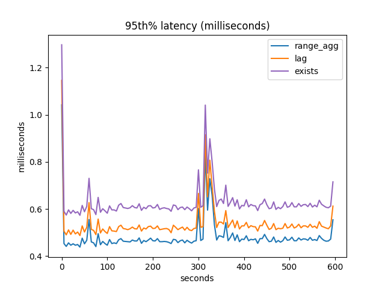
  <figcaption>100k employees</figcaption>
</figure>

Notes:

- This is 95% latency again. `range_agg` has the lowest latency.
- See what I mean about noise affecting everyone the same?
- I got this spike every run I did, and I never got to the bottom of it.


# Median Latency

<figure>
  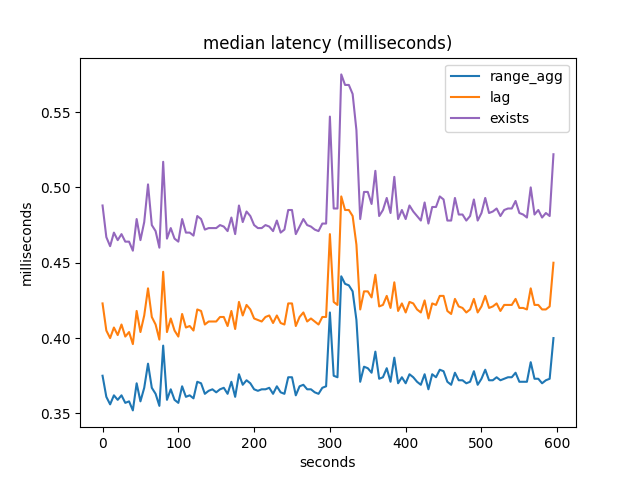
  <figcaption>100k employees</figcaption>
</figure>

Notes:

- Here is median latency.


# Mean Latency

<figure>
  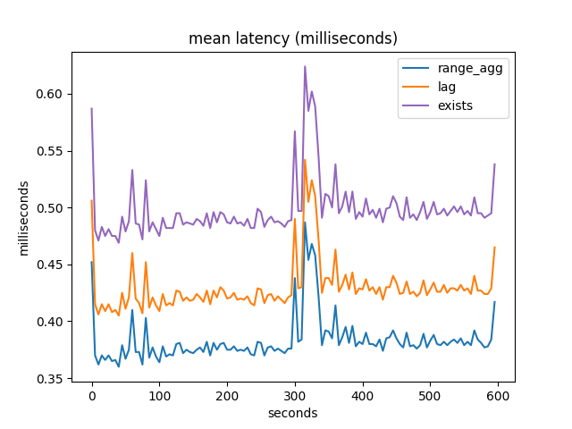
  <figcaption>100k employees</figcaption>
</figure>

Notes:

- Here is mean latency.
- `EXISTS` is slow again.
- It only outperforms when most of the checks are for invalid records.
- In full disclosure, this is a story from last summer that I had trouble reproducing more recently.
  - I like it because it was a surprise and took some work to make sense of.
  - But when I was generating new graphs the other week, I couldn't make EXISTS faster, no matter how many errors I caused.
  - So perhaps there was an additional condition required to cause the imbalance.
  - I'd like to keep digging.


# Throughput

<figure>
  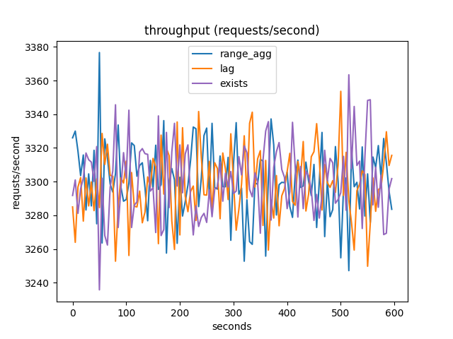
  <figcaption>100k employees</figcaption>
</figure>

Notes:

- Btw here is throughput.
- I thought I would see something here, but I guess not.
- Maybe because I told Benchbase to give them all 33% of the workload?


# 95% Latency

<figure>
  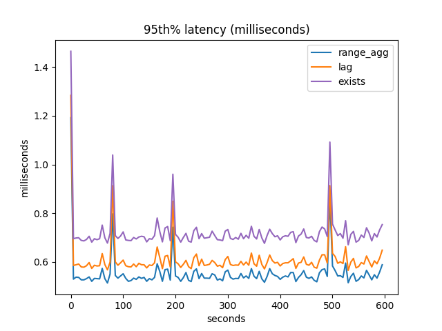
  <figcaption>10M employees</figcaption>
</figure>

Notes:

- So then I tried some simple variations.
- Here is 10 million employees, with positions scaled accordingly.
- We're getting the same results as before.


# Median Latency

<figure>
  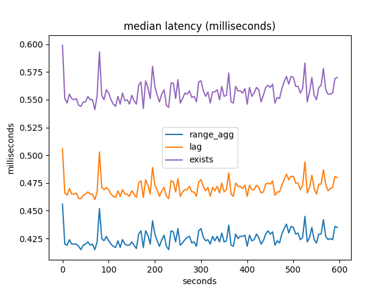
  <figcaption>10M employees</figcaption>
</figure>

Notes:

- Here is median latency.


# Mean Latency

<figure>
  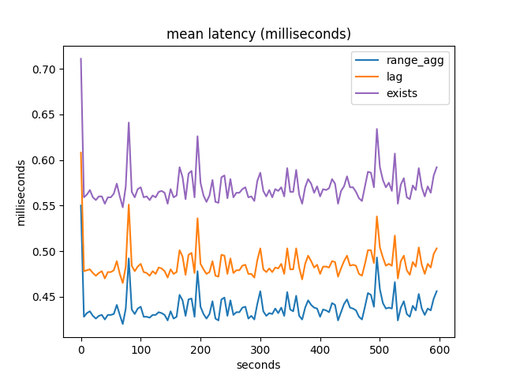
  <figcaption>10M employees</figcaption>
</figure>

Notes:

- Nothing surprising here.


# With History

```
protected void updateEmployees(Connection conn, int lo, int hi) throws SQLException {
  String sql =
      "UPDATE employees FOR PORTION OF valid_at FROM ? TO ? " +
      "SET salary = salary * 1.01 " +
      "WHERE id = ?";
  RandomDistribution.Gaussian gaussian =
      new RandomDistribution.Gaussian(this.rng(), 0, config.getMaxSalaryHistory());

  try (PreparedStatement employeeUpdate = conn.prepareStatement(sql)) {
    // For each employee:
    for (int i = lo; i <= hi; i++) {
      int raises = gaussian.nextInt();
      LocalDate s = this.model.today;
      LocalDate e;

      // For each raise:
      for (int j = 0; j < raises; j++) {
        // All employees were hired in the past, so we can start from today
        // and give a raise every year.
        e = s.plusDays(365);

        employeeUpdate.setDate(1, Date.valueOf(s));
        employeeUpdate.setDate(2, Date.valueOf(e));
        employeeUpdate.setInt(3, i);
        employeeUpdate.addBatch();

        s = e;
      }
    }
  }
}
```

Notes:

- What about if there's a salary history?
- Every year we give an employee a raise.
- This means one employee's history is split up into multiple rows,
  and the foreign key is only valid if all the rows combine to cover its valid-time.
- I thought `range_agg` might be worse here, since it has to combine all those rows into a multirange.
- So I added this code as an optional part of our "load" step, which is what we run before the benchmark, to prepare the data.


# 95% Latency

<figure>
  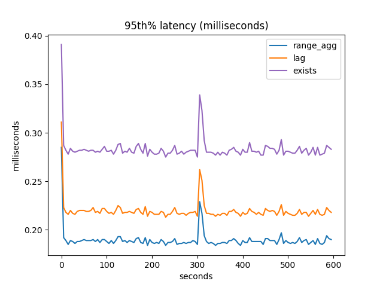
  <figcaption>100k employees, salary history</figcaption>
</figure>

Notes:

- Here is 95% latency.
- Again `range_agg` is the winner.
- I guess the extra records are affecting everyone equally.


# Median Latency

<figure>
  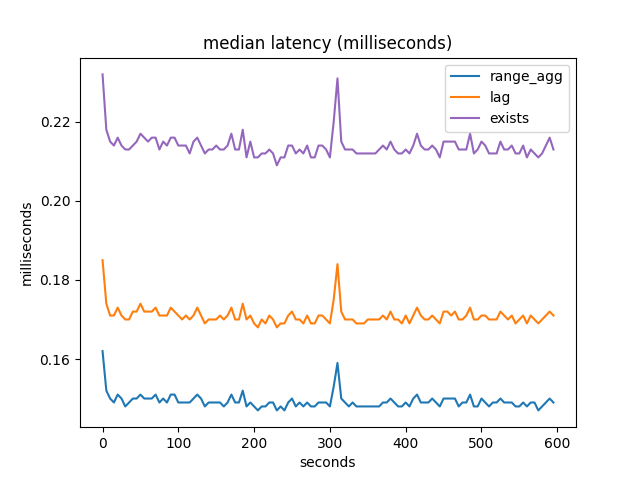
  <figcaption>100k employees, salary history</figcaption>
</figure>

Notes:

- Here is median latency, same result as before.


# Mean Latency

<figure>
  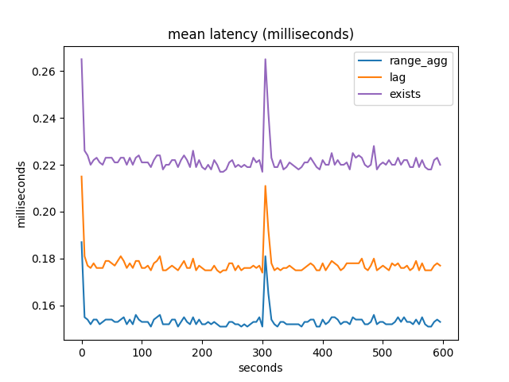
  <figcaption>100k employees, salary history</figcaption>
</figure>

Notes:

- Again, nothing surprising in mean latency.


# Future Work

- More experiments
- More system stats
- `PERIOD`s
- Compare to other RDBMSes

Notes:

- There's a lot more I'd like to do:
  - So far the only serious experiments I've run are on foreign key implementions.
    - Even here there's plenty more you could do.
      - I mentioned interpreting numbers with a comparison.
      - What I'd really like is to design a workload, and then run it with and without foreign keys, to see what they are costing you.
      - Then maybe compare that to a similar non-temporal workload showing what regular foreign keys cost.
      - That's all a bit more work.
  - And then there's lots beyond foreign keys!
    - I have a few competing SQL implementations for outer join and other things, and I want to compare them.
    - If I can get the Dignös patch to apply after all these years, I want to try reverse-engineering their results.
  - I want to collect more stats from the system, like CPU and IO.
  - I want to revise the benchmark schema to use SQL:2011 `PERIOD`s instead of range types, so that is not Postgres-specific.
  - And then of course I want to compare things across database vendors.
    - Today nobody else has temporal foreign keys, but temporal update and delete are supported in Mariadb and IBM DB2.


# References
<!-- .slide: class="references" -->

- https://github.com/pjungwir/introducing-a-temporal-benchmark-in-benchbase
- https://dl.acm.org/doi/10.1145/2213836.2213886
- https://www.vldb.org/pvldb/vol7/p277-difallah.pdf
- https://github.com/cmu-db/benchbase
- https://github.com/pjungwir/benchbase/tree/temporal
- https://github.com/pjungwir/temporal_ops
- https://illuminatedcomputing.com/pages/pdxpug2024-benchbase-and-temporal-foreign-keys/
- https://github.com/pjungwir/postgresql/tree/valid-time
- https://github.com/pjungwir/benchmarking-temporal-tables


# Thank you

https://github.com/pjungwir/introducing-a-temporal-benchmark-in-benchbase
